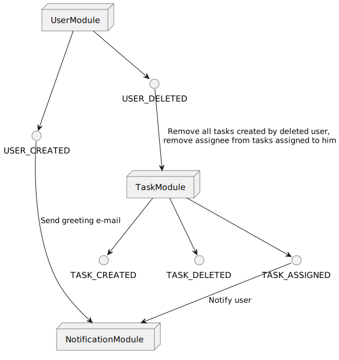
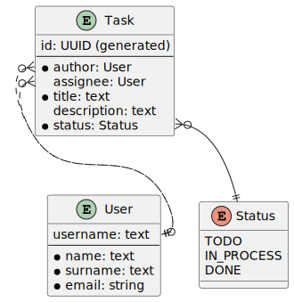

# Demo service

## Launch notes
* Rename `name`, `description`, `github` to corresponding values
* Configure settings.xml
  * 
    * First option: settings in local maven repository (`~/.m2/settings.xml`)
    * Second option: settings in project root
  * Settings can be specified using:
    * mvn -s settings.xml
    * IDEA: Maven settings -> User settings file
  * Settings must contain dummy mirror to override default blocking mirror that blocks http
  ```
  <mirrors>
    <mirror>
      <id>maven-default-http-blocker</id>
      <mirrorOf>dummy</mirrorOf>
      <name>Dummy mirror</name>
      <url>http://0.0.0.0/</url>
    </mirror>
  </mirrors>
  ```

* For local app launch, use **dev** profile. It uses in-memory database
* For production deploy, run app with no profile
* Your app image will be automatically built and available at `ghcr.io/username/repository` 

## API

### Authentication module

- **POST /authentication**: Authenticate
- **POST /authentication/refresh**: Refresh authentication

### User module

- **POST /users**: Register
- **POST /authentication**: Authenticate
- **POST /authentication/refresh**: Refresh authentication
- **GET /users/me**: Get information about current user
- **DELETE /users/me**: Delete current user

### Task module

- **POST /tasks**: Create task
- **GET /tasks**: Get all tasks
- **GET /tasks/{id}**: Get task
- **POST /tasks/{id}/assignee/{username}**: Assign task
- **DELETE /tasks/{id}**: Delete task

### OpenAPI
* **GET /swagger-ui.html**: Swagger UI
  * Paste bearer token to Authorize window to have access to secured endpoints

## Synchronous calls (through interfaces)

`AuthService.authenticate` -> `UserService.getUser(username)`

## Authentication

**Authenticate**

Request:

POST /authentication

```json
{
    "username": "<username>",
    "password": "<password>"
}
```

Response:

```json
{
    "accessToken": "<token>",
    "refreshToken": "<token>"
}
```

Access token should be used in all other requests as header:
`Authorization: Bearer <access token>`

**Refresh authentication**

Request:

POST /authentication/refresh

As an auth token refresh token should be used in request header: `Authorization: Bearer <refresh token>`


## Messaging

### User module

Output events:

- **USER_CREATED**
- **USER_DELETED**


### Task module

Input events:

- **USER_DELETED** - Remove all tasks created by deleted user,
remove assignee from tasks assigned to him

Output events:

- **TASK_CREATED**
- **TASK_DELETED**
- **TASK_ASSIGNED**

### Notification module

Input events:

- **USER_CREATED** - send greeting e-mail
- **TASK_ASSIGNED** - Notify user

```plantuml:messaging
@startuml
node UserModule
node TaskModule
node NotificationModule

'UserModule outputs
UserModule --> USER_CREATED
UserModule --> USER_DELETED

'TaskModule inputs
USER_DELETED --> TaskModule: Remove all tasks created by deleted user,\n \
remove assignee from tasks assigned to him
'TaskModule outputs
TaskModule --> TASK_CREATED
TaskModule --> TASK_DELETED
TaskModule --> TASK_ASSIGNED

'NotificationModule inputs
USER_CREATED --> NotificationModule: Send greeting e-mail
TASK_ASSIGNED --> NotificationModule: Notify user


@enduml
```




## Entity-relationship model

```plantuml:entities
@startuml entities
entity User {
    username: text
    --
    * name: text
    * surname: text
    * email: string
}

entity Task {
    id: UUID (generated)
    --
    *author: User
    assignee: User
    *title: text
    description: text
    *status: Status
}

enum Status {
    TODO
    IN_PROCESS
    DONE
}

Task::author }o..|| User::username
Task::assignee }o..o| User::username
Task::status }o--|| Status
@enduml
```



## Project structure

### Packages

Any module should be divided into `api` & `impl` base packages 
to define classes that can be used in other modules.

* users
  * api
    * controller
    * messaging
    * model
    * service
  * impl
    * entity
    * repository
    * service
* auth
  * api
    * controller
    * service
    * model
  * impl
    * config
    * service
* tasks
  * api
    * controller
    * messaging
    * service
  * impl
    * entity
    * repository
    * service
* notifications
  * api
    * controller
    * messaging
    * model
    * service
  * impl
    * config
    * entity
    * repository
